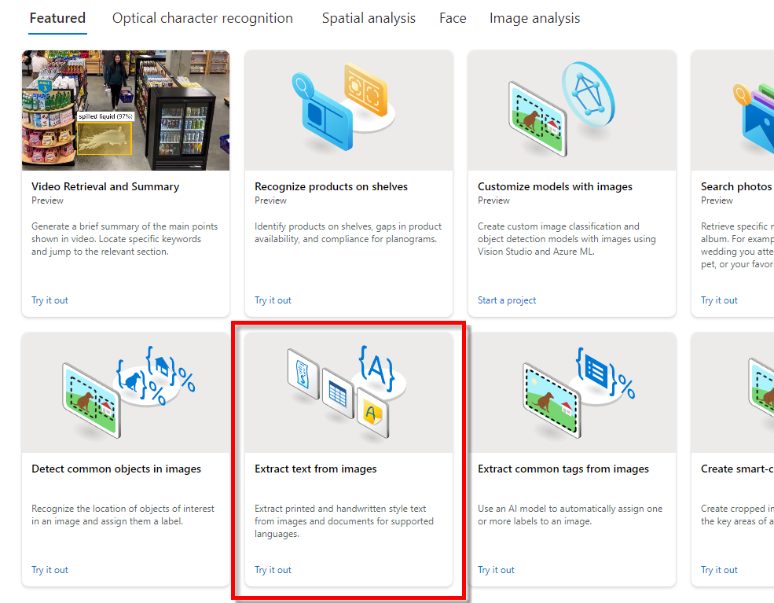
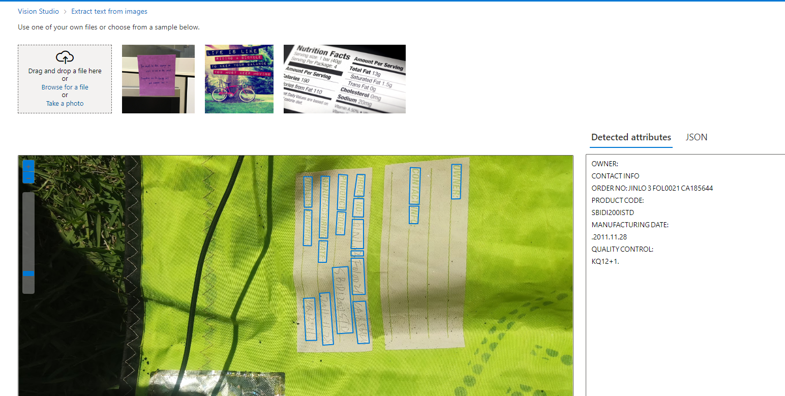

# Projeto Azure-I900_Vision: Testes de Reconhecimento de Imagem e OCR

Recebemos um guia abrangente da instrutora para conduzir testes de verificação e extração de textos de imagens por meio da ferramenta Azure-I900_Vision. Essa poderosa plataforma nos proporciona retornos estruturados em formato JSON, simplificando a exportação para integração em nossas aplicações web.

Abaixo, você encontrará capturas de tela que destacam o processo de seleção de opções na ferramenta, enfatizando a extração bem-sucedida de textos complexos.

Essa ferramenta apresenta um notável potencial para aprimorar as capacidades de reconhecimento de imagem e extração de texto. Estamos entusiasmados em continuar explorando as diversas possibilidades de integrar esses resultados valiosos em nossas aplicações web.

Expressamos nossa gratidão à instrutora pela orientação detalhada fornecida, e estamos ansiosos para continuar refinando nossas habilidades neste campo promissor.